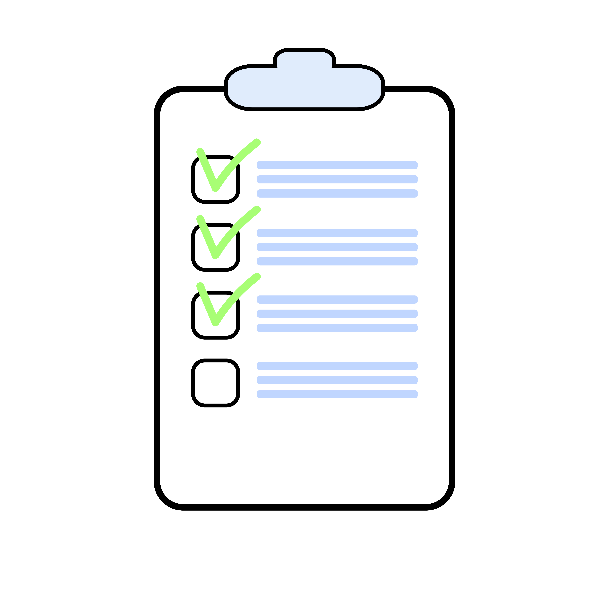

# tt (task tracker)

A simple, yet powerful, task tracker

## Background

Task tracking is a surprisingly complex and unwieldy beast. What works for one often does not satisfy his friend.
Sometimes the system cannot do something one person finds essential, while another is annoyed by the plethora of
features that just get in his way when he "just wants to get something simple done".

Task Tracker, then - is not promising to be everything for everyone. Rather it is designed to serve me and get
_my_ tasks done smoothly and simply.

## How it works

`tt` is a command-line utility that can quickly add new tasks and filter them by tag. By default it orders tasks
based on when they were added and when they are modified. Latest tasks are highest on the list. This, I find, gives
an excellent heuristic for _what is important_ mixed nicely with _what you need to do *now*_.

Notes can be added to tasks which I find also are immensely useful. Tasks cannot be nested - I find that is more
convenient to use :tags to label tasks and sub tasks and filter them that way.

## Why it works

It is amazingly fast to add, close, and review the entire task list. It stays out of my way and takes less than a
fraction of a second to perform any activity - from pulling up tasks, closing tasks, and adding new tasks. It is
cleverly designed to make it easier to manage tasks higher up in the list than lower and that also drives the
value it provides - prioritized tasks are just easier to work on than lower priority tasks. Finally, it uses a
simple text file to store everything, using a log datastore which makes it almost impossible to corrupt. All-in-all
an excellent solution for my own needs.

